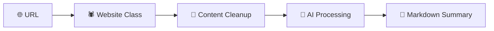

# 🌐 Website Summarizer

> *Transform any webpage into intelligent, AI-powered summaries with local LLM magic* ✨

[](https://python.org)
[](https://ollama.ai)
[](https://www.crummy.com/software/BeautifulSoup/)

---

## ✨ What It Does

This sleek Python tool combines **web scraping** with **local AI** to deliver crystal-clear website summaries. No API keys, no cloud dependency—just pure local intelligence powered by Ollama.

```python
# One line to rule them all
display_summary("https://your-favorite-site.com")
```

---

## 🚀 Features

| Feature | Description |
|---------|-------------|
| 🕷️ **Smart Scraping** | Intelligently extracts content while filtering noise |
| 🤖 **Local AI Power** | Llama 3.2 running on your machine—complete privacy |
| 📝 **Markdown Magic** | Beautiful, formatted summaries ready to use |
| 🎯 **Content Focus** | Ignores navigation clutter, focuses on the good stuff |
| 📊 **Jupyter Ready** | Built-in display functions for notebooks |

---

## 🛠️ Quick Setup

### Prerequisites
- 🦙 **Ollama** running on `localhost:11434`
- 🧠 **Llama 3.2** model installed
- 🐍 **Python 3.7+**

### Installation
```bash
# Install the magic ingredients
pip install requests beautifulsoup4 python-dotenv openai ipython

# Start your local AI engine
ollama serve
ollama pull llama3.2
```

---

## 🎮 Usage

### 🎯 Quick Start
```python
from website_summarizer import summarize, display_summary

# Get instant insights
summary = summarize("https://techcrunch.com")
print(summary)

# Jupyter notebook magic ✨
display_summary("https://hackernews.com")
```

### 🔧 Power User Mode
```python
# Deep dive into any website
website = Website("https://example.com")
print(f"📄 Title: {website.title}")
print(f"📝 Preview: {website.text[:200]}...")

# Custom AI conversations
messages = messages_for(website)
```

---

## 🏗️ Architecture

<div align="center">



</div>

### 🎭 Core Components

#### `Website` Class
The web scraping superhero that:
- 🎯 Fetches any URL with stealth headers
- 🧹 Strips away navigation noise
- 📄 Extracts pure, valuable content

#### `summarize()` Function
Your AI summarization wizard:
- 🤖 Connects to local Ollama instance
- 💬 Crafts perfect prompts
- ✨ Returns markdown-formatted insights

---

## ⚙️ Configuration

### 🕵️ Stealth Mode Headers
```python
headers = {
    "User-Agent": "Mozilla/5.0 (Windows NT 10.0; Win64; x64) AppleWebKit/537.36"
}
```

### 🧠 AI Personality
```python
system_prompt = """
You are an assistant that analyzes websites and provides short summaries,
ignoring navigation clutter. Respond in beautiful markdown.
"""
```

---

## 🎨 Customization Playground

### 🔄 Switch AI Models
```python
response = openai.chat.completions.create(
    model="mistral",  # Try different models!
    messages=messages_for(website)
)
```

### 🌍 Multilingual Magic
```python
system_prompt = "Analyze websites and respond in elegant Spanish markdown."
```

### 🎛️ Content Filtering
```python
# Remove even more noise
for noise in soup.body(["script", "style", "img", "nav", "footer", "aside"]):
    noise.decompose()
```

---

## 🎯 Real-World Examples

```python
# 📰 News Analysis
display_summary("https://news.ycombinator.com")

# 📚 Documentation Digest  
display_summary("https://docs.python.org")

# 🏢 Company Research
summary = summarize("https://openai.com")
```

---

## 🔧 Troubleshooting

| Issue | Solution |
|-------|----------|
| 🚫 Connection Error | `ollama serve` then retry |
| 🤖 Model Missing | `ollama pull llama3.2` |
| 📦 Import Fails | `pip install -r requirements.txt` |
| 🛡️ Site Blocks You | Check headers, try different sites |

### 🩺 Health Check
```bash
# Verify Ollama is alive
curl http://localhost:11434/api/tags

# Test model availability
ollama list
```

---

## 🌟 Pro Tips

> 💡 **Performance Tip**: Use `llama3.2:1b` for faster summaries on slower machines

> 🎯 **Quality Tip**: Add specific instructions to your system prompt for domain-specific content

> 🔒 **Privacy Win**: Everything runs locally—your data never leaves your machine

---

## 🤝 Contributing

Found a bug? Have an idea? 

1. 🍴 Fork it
2. 🌟 Star it  
3. 🐛 Fix it
4. 📤 PR it

---

## 📜 License

**MIT Licensed** - Use it, modify it, love it! 💖

---

<div align="center">

**Built with ❤️ by developers, for developers**

*Transform the web, one summary at a time* 🌐➡️📝

</div>
